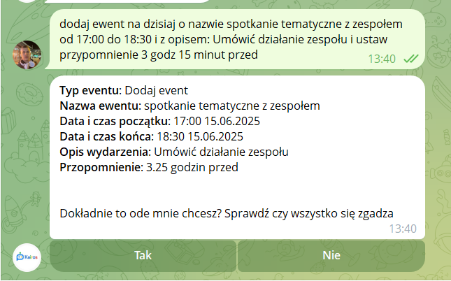

# Kairos-AI  
Kairos AI - your Google Calendar AI Assystent  

### Contents:  
- [How it works?](#how-it-works)  
  - [Log in](#log-in)  
  - [Log out](#log-out)  
  - [Adding events](#adding-events)  
  - [Deleting events](#deleting-events)  
  - [Showing events](#showing-events)  
  - [Modification](#modification)  
  - [Showing incoming events](#showing-incoming-events)  
  - [Troubleshoot](#Troubleshoot)
## How it works? 

 - ### Log in
 <br>

 - ### Logout
 <br>  

 - ### Adding events
 <br>  

 - ### Deleting events
 <br>  

 - ### Showing events
 <br> 

 - ### Modification
    <br>

 - ### Showing incoming events
 

## Instalation
#### Requirments:
- Python 3.10<sub>(other versions >3.10 should work as well)</sub>
- protobuf 5.29.3
- dotenv 0.9.9
- python-dotenv1.1.0
- pydantic 2.10.5
- pytest 7.4.4
- sympy 1.13.1
- telebot 0.0.5
- pyTelegramBotAPI 4.27.0
- python-dateutil 2.9.0.post0
- google-api-python-client 2.170.0
- peewee 3.18.1
- oauthlib 3.2.2
- google-auth-oauthlib 1.2.2
- Flask 3.1.0
- requests 2.32.3
- google-generativeai 0.8.5
#### STEP 1:
```cmd
    git clone https://github.com/Volodymyr1233/KairosAI.git
```
#### STEP 2:
```cmd
    cd KairosAI
```
#### STEP 3:
```cmd
    pip install -r requirements.txt
```
#### STEP 4:
```cmd
    python Telegram/bot.py
```
## Troubleshoot
If you encounter any issues or if something isn’t working as expected, feel free to reach out here. You can report problems or ask for help by creating an issue on GitHub.

- **GitHub Issues**: [GitHub Issues](https://github.com/Volodymyr1233/KairosAI/issues)

Please share any problems you face, and I’ll do my best to assist you!
